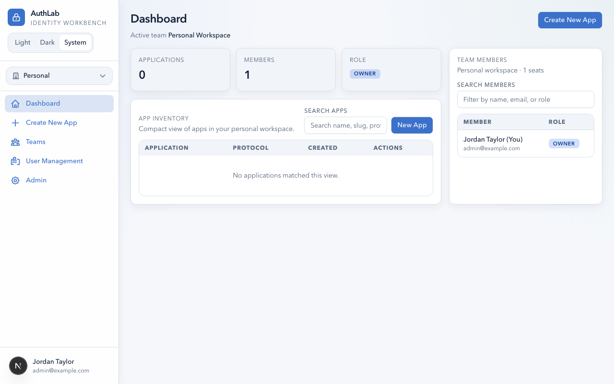
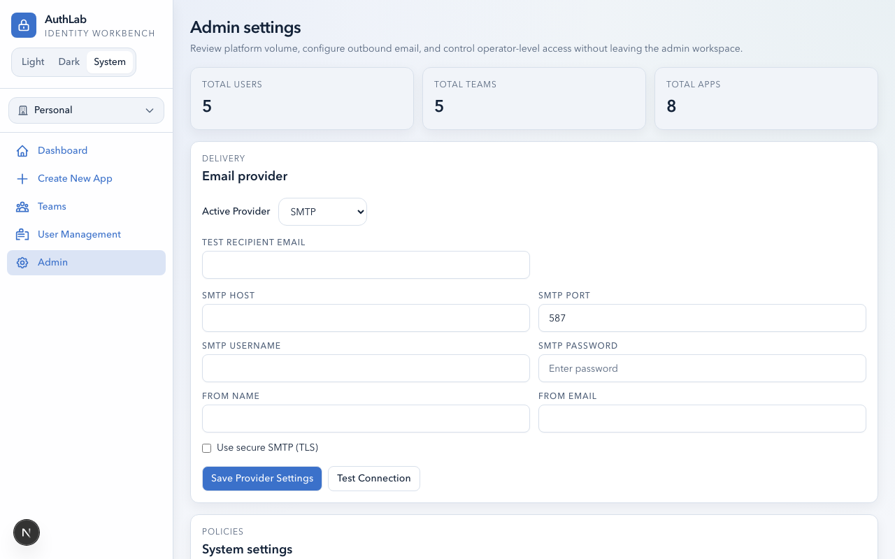
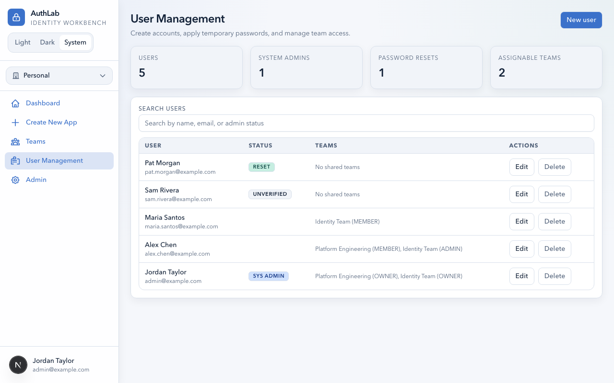
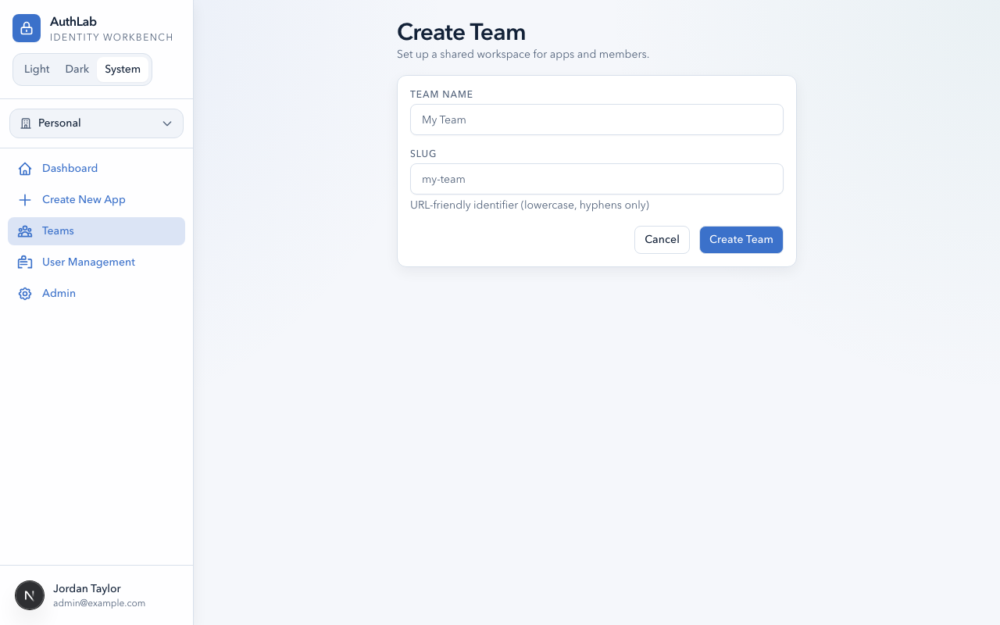
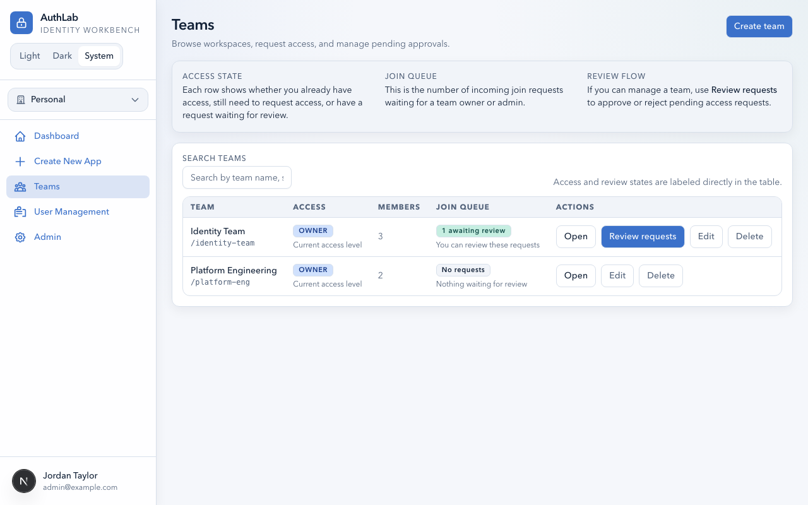
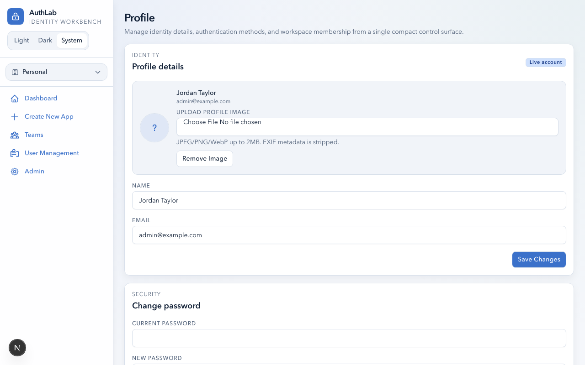

# AuthLab — Administrator Guide

> A guide for system administrators managing the AuthLab platform.

---

## Table of Contents

- [Overview](#overview)
  - [System Architecture](#system-architecture)
  - [Quick Start Checklist](#quick-start-checklist)
- [Initial Setup](#initial-setup)
  - [First Admin Account](#first-admin-account)
  - [Environment Configuration](#environment-configuration)
  - [Database Setup](#database-setup)
- [Email Delivery](#email-delivery)
  - [Configuring SMTP](#configuring-smtp)
  - [Configuring Brevo](#configuring-brevo)
  - [Testing Email Delivery](#testing-email-delivery)
- [User Management](#user-management)
  - [Viewing All Users](#viewing-all-users)
  - [Creating a New User](#creating-a-new-user)
  - [Editing a User](#editing-a-user)
  - [Deleting a User](#deleting-a-user)
  - [Assigning Users to Teams](#assigning-users-to-teams)
- [Team Management](#team-management)
  - [Creating Teams](#creating-teams)
  - [Managing Team Membership](#managing-team-membership)
  - [Reviewing Join Requests](#reviewing-join-requests)
- [Security](#security)
  - [Password Policy](#password-policy)
  - [Two-Factor Authentication](#two-factor-authentication)
  - [Passkeys (WebAuthn)](#passkeys-webauthn)
  - [Session Security](#session-security)
  - [Content Security Policy](#content-security-policy)
  - [Encryption at Rest](#encryption-at-rest)
- [Platform Settings](#platform-settings)
  - [Admin Settings Overview](#admin-settings-overview)
  - [System Policies](#system-policies)
- [Maintenance](#maintenance)
  - [Database Migrations](#database-migrations)
  - [Backup and Recovery](#backup-and-recovery)
  - [Monitoring](#monitoring)
- [Reference](#reference)
  - [Environment Variables](#environment-variables)
  - [User Roles Summary](#user-roles-summary)
  - [API Endpoints Summary](#api-endpoints-summary)

---

## Overview

### System Architecture

AuthLab is a Next.js web application that provides a multi-tenant workspace for testing OIDC, SAML, and SCIM integrations. Key architectural components:

- **Web Application** — Next.js 16 with App Router, server-side rendering, and API routes
- **Database** — SQLite (local development) or Turso/libSQL (production)
- **Session Management** — Encrypted iron-session cookies (no server-side session store)
- **Email** — Pluggable SMTP or Brevo (Sendinblue) provider for transactional emails
- **Encryption** — AES-256-GCM for secrets at rest, Argon2id for password hashing

### Quick Start Checklist

Use this checklist when setting up a new AuthLab instance:

- [ ] Set required environment variables (`MASTER_ENCRYPTION_KEY`, `SESSION_PASSWORD`, `NEXT_PUBLIC_APP_URL`)
- [ ] Configure database connection (SQLite for local, Turso for production)
- [ ] Run database migrations (`npx prisma db push`)
- [ ] Start the application
- [ ] Register the first user account (automatically becomes System Admin)
- [ ] Configure email delivery (SMTP or Brevo) in Admin Settings
- [ ] Send a test email to verify delivery
- [ ] Create teams for your organization
- [ ] Invite users or enable self-registration

---

## Initial Setup

### First Admin Account

The first user to register on a new AuthLab instance is automatically granted **System Admin** privileges. The admin dashboard includes additional sidebar items for **User Management** and **Admin** settings.



This user can then:

1. Access the Admin panel to configure email delivery
2. Create additional teams
3. Manage other users and promote them to System Admin if needed

### Environment Configuration

AuthLab requires the following environment variables. Set these before starting the application.

| Variable | Required | Description |
|----------|----------|-------------|
| `MASTER_ENCRYPTION_KEY` | Yes | 64-character hex string for AES-256-GCM encryption of secrets |
| `SESSION_PASSWORD` | Yes | 64-character hex string for iron-session cookie encryption |
| `NEXT_PUBLIC_APP_URL` | Yes | Public URL of the application (e.g., `https://authlab.example.com`) |
| `DATABASE_URL` | Local | SQLite file path (e.g., `file:./dev.db`) |
| `TURSO_DATABASE_URL` | Production | Turso database URL |
| `TURSO_AUTH_TOKEN` | Production | Turso authentication token |

> **Warning:** Generate `MASTER_ENCRYPTION_KEY` and `SESSION_PASSWORD` using a cryptographically secure random generator. Never reuse keys across environments. Changing these keys after deployment will invalidate all encrypted data and active sessions.

### Database Setup

**Local development (SQLite):**
```
DATABASE_URL=file:./dev.db
npx prisma db push
```

**Production (Turso):**
```
TURSO_DATABASE_URL=libsql://your-db.turso.io
TURSO_AUTH_TOKEN=your-auth-token
```

Apply migrations using the SQL files in `prisma/turso-migrations/` via the Turso CLI.

---

## Email Delivery

Email delivery is required for email verification, password reset, and team invitation features. Without a configured email provider, these features will silently suppress email sending (the application will still respond with generic messages to prevent information leakage).

Navigate to **Admin** > **Admin Settings** to configure email delivery.



### Configuring SMTP

1. Set **Active Provider** to **SMTP**.
2. Fill in the SMTP configuration:

   | Field | Description | Example |
   |-------|-------------|---------|
   | SMTP Host | Mail server hostname | `smtp.gmail.com` |
   | SMTP Port | Mail server port | `587` (TLS) or `465` (SSL) |
   | SMTP Username | Authentication username | `noreply@example.com` |
   | SMTP Password | Authentication password | *(write-only, masked after save)* |
   | From Name | Display name on emails | `AuthLab` |
   | From Email | Sender email address | `noreply@example.com` |
   | Use secure SMTP (TLS) | Enable TLS encryption | Checked for port 587 |

3. Click **Save Provider Settings**.

> **Note:** SMTP passwords are encrypted at rest using AES-256-GCM. The password is never displayed after saving — the form only shows whether a password has been set.

### Configuring Brevo

1. Set **Active Provider** to **Brevo**.
2. Enter your **Brevo API Key** (from Brevo dashboard > SMTP & API > API Keys).
3. Set the **From Name** and **From Email**.
4. Click **Save Provider Settings**.

### Testing Email Delivery

1. Enter a **Test Recipient Email** address.
2. Click **Test Connection**.
3. Check the recipient's inbox for a test email from AuthLab.

If the test fails, verify your SMTP credentials or API key, and ensure the mail server is reachable from the AuthLab server.

---

## User Management

System Admins can manage all platform users from the **User Management** page.



The page shows:

- **Summary cards** — Total users, system admins, pending password resets, and assignable teams
- **User table** — Each user with their status badges, team memberships, and action buttons

### Viewing All Users

Navigate to **User Management** in the sidebar. The table shows all registered users with:

| Column | Description |
|--------|-------------|
| **User** | Name and email |
| **Status** | Badges: `SYS ADMIN`, `UNVERIFIED`, `RESET` (must change password) |
| **Teams** | Team names and roles in parentheses |
| **Actions** | Edit and Delete buttons |

Use the search bar to filter users by name, email, or admin status.

### Creating a New User

1. Click **New User** in the top-right corner.
2. Fill in the user's name, email, and a temporary password.
3. Optionally check **Must Change Password** to force a password reset on first login.
4. Click **Create User**.

> **Tip:** Use the **Must Change Password** flag when creating accounts on behalf of users. They will be prompted to set their own password on first sign-in.

### Editing a User

1. Click **Edit** next to the user in the table.
2. You can modify:
   - **Name** and **Email**
   - **System Admin** status (toggle on/off)
   - **Must Change Password** flag
   - **Verified** status
   - **MFA Enabled** (disable if user is locked out)
3. Click **Save Changes**.

> **Warning:** Disabling MFA removes the user's TOTP secret. They will need to set up a new authenticator if MFA is re-enabled.

### Deleting a User

1. Click **Delete** next to the user.
2. Confirm the deletion.

> **Warning:** Deleting a user permanently removes their account, team memberships, passkeys, and all associated data. This action cannot be undone.

### Assigning Users to Teams

From the user edit form, you can assign the user to teams with a specific role (Owner, Admin, or Member). You can also manage team membership from the team detail pages.

---

## Team Management

Teams are the organizational unit in AuthLab. Each team has its own set of applications and members.

### Creating Teams

1. Navigate to **Teams** in the sidebar.
2. Click **Create Team**.

   

3. Enter a **Team Name** (a URL-friendly slug is auto-generated).
4. Click **Create Team**.

> **Note:** Only System Admins can create teams. Each user also has an auto-created **Personal Workspace** team.

### Managing Team Membership



From the teams directory or a team detail page:

- **Invite members** — Send email invitations with a specific role
- **Remove members** — Click the remove button next to a member
- **Change roles** — Promote or demote members between Owner, Admin, and Member

| Role | Permissions |
|------|-------------|
| **Owner** | Full control: manage members, apps, settings, delete team |
| **Admin** | Manage members, apps, invitations, review join requests |
| **Member** | View and test apps, view team members |

### Reviewing Join Requests

When users request to join a team, team Owners and Admins see pending requests in the team detail page. Review each request and either **Approve** or **Reject** it.

---

## Security

### Password Policy

AuthLab enforces the following password security measures:

- **Hashing**: All passwords are hashed with Argon2id (the current OWASP recommendation)
- **Legacy migration**: Existing bcrypt hashes are automatically rehashed to Argon2id on successful login
- **Complexity**: Passwords must include uppercase, lowercase, numbers, and symbols

### Two-Factor Authentication



- Users can enable TOTP-based MFA from their Settings page
- Admins can force-disable MFA for locked-out users via User Management
- MFA secrets are encrypted at rest (AES-256-GCM)
- TOTP codes follow the standard 30-second time window

### Passkeys (WebAuthn)

- Users can register multiple passkeys (biometric, security key, etc.)
- Passkeys provide passwordless login as an alternative to email/password
- Passkey credentials are stored securely with public keys only

### Session Security

- Sessions use iron-session encrypted cookies
- No server-side session store — all session data is in the encrypted cookie
- Sessions include CSRF protection via origin and content-type checks
- `SameSite` cookie attributes are configured for cross-origin IdP callback compatibility

### Content Security Policy

AuthLab sets a strict CSP header:

- `script-src 'self' 'nonce-{random}'` — Only same-origin scripts with the correct nonce
- `style-src 'self' 'unsafe-inline'` — Same-origin stylesheets with inline styles allowed
- `img-src 'self' data: blob:` — Same-origin images plus data URIs
- `frame-ancestors 'none'` — Prevents clickjacking
- HSTS is enabled in production with `max-age=31536000; includeSubDomains`

### Encryption at Rest

Sensitive fields are encrypted using AES-256-GCM with the `MASTER_ENCRYPTION_KEY`:

- OIDC client secrets
- SAML IdP certificates
- SAML SP signing and encryption private keys
- SMTP/Brevo API credentials
- TOTP secrets
- OAuth access and refresh tokens
- Auth run trace responses

---

## Platform Settings

### Admin Settings Overview

The Admin Settings page provides a single view for platform configuration.


The page includes:

- **Platform stats** — Total users, teams, and applications
- **Email provider** — SMTP or Brevo configuration
- **System policies** — Platform-wide behavior settings

### System Policies

The **System Settings** section (below the email provider) allows administrators to configure platform-wide policies. These settings are stored in the `SystemSetting` database table and control behaviors like:

- Registration policies
- Email verification requirements
- Default team settings

---

## Maintenance

### Database Migrations

**Local (SQLite):**
```bash
npx prisma db push
```

**Production (Turso):**
Apply SQL migration files from `prisma/turso-migrations/` using the Turso CLI:
```bash
turso db shell your-database < prisma/turso-migrations/MIGRATION_FILE.sql
```

Migration files are numbered by date and describe the changes being applied.

### Backup and Recovery

- **SQLite**: Back up the `dev.db` file regularly
- **Turso**: Use Turso's built-in backup and replication features
- **Encryption keys**: Back up `MASTER_ENCRYPTION_KEY` and `SESSION_PASSWORD` securely — losing these keys means losing access to all encrypted data

> **Warning:** If `MASTER_ENCRYPTION_KEY` is lost or changed, all encrypted secrets (client secrets, certificates, TOTP secrets, tokens) will become unreadable. Store it in a secure vault.

### Monitoring

Monitor the application through:

- **Server logs** — Standard output from the Next.js server
- **Database metrics** — Query performance via Turso dashboard (production)
- **SCIM request logs** — Per-app audit trail accessible through the test page UI
- **Auth run history** — Per-app authentication session history with lifecycle events

---

## Reference

### Environment Variables

| Variable | Required | Default | Description |
|----------|----------|---------|-------------|
| `MASTER_ENCRYPTION_KEY` | Yes | — | 64-char hex for AES-256-GCM |
| `SESSION_PASSWORD` | Yes | — | 64-char hex for iron-session |
| `NEXT_PUBLIC_APP_URL` | Yes | — | Public application URL |
| `DATABASE_URL` | Dev | `file:./dev.db` | SQLite database path |
| `TURSO_DATABASE_URL` | Prod | — | Turso database URL |
| `TURSO_AUTH_TOKEN` | Prod | — | Turso auth token |
| `NODE_ENV` | — | `development` | Runtime environment |

### User Roles Summary

| Scope | Role | Key Capabilities |
|-------|------|-----------------|
| **System** | System Admin | User CRUD, team creation, email config, admin panel |
| **System** | Regular User | Access own teams and apps, personal settings |
| **Team** | Owner | Full team control, member management, app management |
| **Team** | Admin | Member management, app management, invite review |
| **Team** | Member | View and test apps, view members |

### API Endpoints Summary

| Category | Count | Base Path |
|----------|-------|-----------|
| Account Security | 17 | `/api/user/*` |
| Admin | 7 | `/api/admin/*` |
| Teams | 15 | `/api/teams/*` |
| App Management | 3 | `/api/apps/*` |
| Auth Protocol | 17 | `/api/auth/*` |
| SAML | 3 | `/api/saml/*` |
| SCIM | 7 groups | `/api/scim/{slug}/*` |
