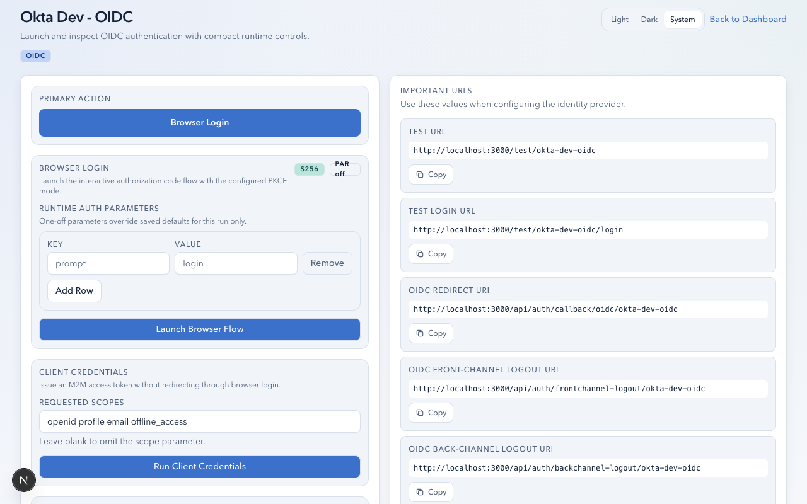
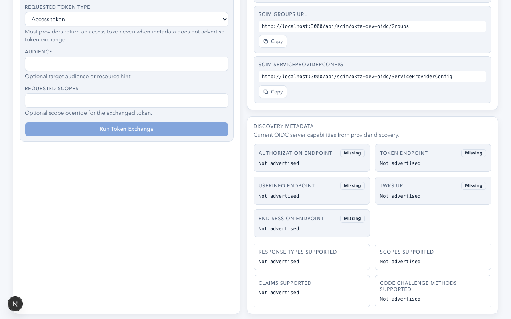

# Inspector & Diagnostics Guide

This guide explains how to use AuthLab's protocol inspector to analyze, validate, and troubleshoot OIDC and SAML authentication sessions.

## Overview

The Inspector is AuthLab's diagnostic workbench. After any authentication flow completes, the Inspector opens with a multi-tab view of the session's tokens, claims, validation results, lifecycle events, and compliance posture.

Each completed auth run (browser login, client credentials, device authorization, token exchange) creates a persistent record that you can revisit from the app's test page.

## Inspector Tabs

The Inspector organizes diagnostics into tabs. Available tabs depend on the protocol (OIDC or SAML) and what data the session produced.

### Session Header

The top bar always shows:
- **Protocol**: OIDC or SAML
- **App slug**: Which app this session belongs to
- **Status**: Authenticated, Logged Out, or Failed
- **Timestamp**: When authentication completed
- **Nonce validation** (OIDC): Pass/fail indicator

Action buttons:
- **RP Logout** (OIDC): Initiates RP-initiated logout
- **SAML SLO** (SAML): Initiates SP-initiated Single Logout
- **Logout**: Clears the local session

## OIDC Inspector

### Lifecycle Panel

The primary diagnostic view for OIDC sessions. Contains:

**Diagnostics Grid (6 cards):**

| Card | What It Shows |
|------|--------------|
| **Run Mode** | Browser Login, Client Credentials, Device Authorization, or Token Exchange |
| **Token Posture** | Active (token not expired), Expired, Expiring Soon, or Inactive |
| **Refresh Posture** | Ready (refresh token available), Rotation Observed (token changed after refresh), or Unavailable |
| **Auth Context** | ACR and AMR claim values from the ID token |
| **Refresh Token** | Available or Not Available |
| **Last Event** | Most recent lifecycle action with timestamp |

**Token Timeline:**

A chronological visualization of the session's lifecycle:
- Token issuance (green dot)
- Refresh events (green dot, shows rotation status)
- Introspection results (blue dot, shows active/inactive)
- Revocation events (gray dot)
- Expiry markers
- Logout events

**Lifecycle Actions:**

Interactive buttons to exercise the token lifecycle against your provider:

| Action | What It Does |
|--------|-------------|
| **Refresh Tokens** | Exchanges refresh token for new access/ID tokens |
| **Introspect Access Token** | Queries the provider's introspection endpoint for access token status |
| **Introspect Refresh Token** | Queries introspection for refresh token status |
| **Revoke Access Token** | Calls the revocation endpoint to invalidate the access token |
| **Revoke Refresh Token** | Calls revocation to invalidate the refresh token |

**Latest Introspection:**

After running an introspection action, a table displays the provider's response:
- `active`: Whether the token is still valid
- `scope`: Granted scopes
- `exp`: Expiration timestamp
- `client_id`: OAuth client identifier
- Additional provider-specific metadata

**Event Log:**

An expandable list of every lifecycle event in chronological order, each showing:
- Event type (AUTHENTICATED, REFRESHED, INTROSPECTED, REVOKED, etc.)
- Status (SUCCESS or FAILED)
- Timestamp
- Expandable request/response/metadata details

### Token Validation Panel

Validates the ID token's cryptographic integrity:

**Signature Validation:**
- Fetches the provider's JWKS (JSON Web Key Set)
- Verifies the ID token signature against the published keys
- Displays: algorithm (e.g., RS256), key ID (kid), JWKS URI
- Status: Valid, Invalid, or Unavailable (JWKS not reachable)

**at_hash Validation:**
- Computes the expected `at_hash` from the access token
- Compares against the `at_hash` claim in the ID token
- Confirms the access token is bound to the ID token
- Status: Valid, Invalid, Missing (claim not present), or Unavailable

**c_hash Validation:**
- Computes the expected `c_hash` from the authorization code
- Compares against the `c_hash` claim in the ID token
- Confirms the authorization code is bound to the ID token
- Only applicable for authorization code flows
- Status: Valid, Invalid, Missing, or Unavailable

Each check shows expected vs. actual values for manual verification.

### UserInfo Panel

Fetches and compares claims from the provider's UserInfo endpoint:

1. Click **Fetch UserInfo** to call the endpoint with the current access token.
2. View the claims returned by UserInfo.
3. Compare side-by-side with ID token claims to identify:
   - Claims present in ID token but missing from UserInfo
   - Claims present in UserInfo but missing from ID token
   - Value mismatches between the two sources

This is especially useful for debugging claim mapping configurations and scope-based attribute release.

### Claims Diff Panel

Compares claims across different auth runs of the same app:

1. Select a **baseline run** from the dropdown (shows recent completed runs).
2. The diff displays:
   - **Added**: Claims present in the current run but absent in the baseline
   - **Removed**: Claims present in the baseline but absent in the current run
   - **Changed**: Claims present in both but with different values
   - **Unchanged**: Claims present in both with identical values

Badge counts show how many claims fall into each category.

Use cases:
- Compare claims before and after a scope change
- Verify claim mapping changes at the provider
- Compare SP-initiated vs. IdP-initiated flow results
- Test the effect of MFA policy changes on `acr`/`amr` claims

### Discovery Metadata View

Displays the provider's OIDC discovery document (`.well-known/openid-configuration`) as formatted JSON. Useful for verifying:
- Supported grant types
- Available endpoints (token, introspection, revocation, userinfo, end_session)
- Supported scopes and claims
- PKCE and PAR support

## SAML Inspector

### SAML Overview Panel

Structured breakdown of the SAML assertion:

**Response Summary:**
- Response issuer and status
- Response issue instant
- Destination and InResponseTo

**Subject:**
- NameID value and format
- Subject confirmation method
- Timing posture (Active, Expired, Future, or Missing)

**Conditions:**
- NotBefore and NotOnOrAfter window
- Audience restrictions
- Timing posture with visual indicator

**Authentication Statement:**
- Authentication instant
- Session index
- Session expiry
- AuthnContextClassRef (the authentication method used)
- Authenticating authorities

**Attributes:**
- All assertion attributes in a sortable table
- Attribute name, value, and format

**Request Parameters:**
- ForceAuthn, IsPassive, AuthnContext, and other settings that were sent in the AuthN request

### Signature Panel

Inspects the SAML response's digital signature structure:

**Aggregate Status:**
- **Verified**: Callback validation passed and no certificate mismatches
- **Warning**: Missing signatures, validation issues, or certificate mismatches
- **Missing**: No signatures detected in the response

**Signature Details (per location):**

| Field | Description |
|-------|-------------|
| **Location** | Response-level or Assertion-level |
| **Signature Algorithm** | e.g., `rsa-sha256` |
| **Canonicalization Algorithm** | XML canonicalization method |
| **References** | URI, digest algorithm, and transforms for each signed element |
| **Embedded Certificate** | Fingerprint and subject of the certificate in the signature |
| **Certificate Match** | Whether the embedded cert matches the configured IdP cert |

**Configured Trust:**
- Shows the IdP certificate subject and SHA-256 fingerprint that AuthLab is configured to trust
- Highlights mismatches between the embedded and configured certificates

### Certificate Health Panel

Analyzes the IdP's signing certificate:

| Field | Description |
|-------|-------------|
| **Status** | Healthy (>30 days), Expiring (0-30 days), Expired, Invalid |
| **Subject** | Certificate subject (CN, O, etc.) |
| **Issuer** | Certificate issuer |
| **Serial Number** | Certificate serial |
| **Valid From** | Start of validity period |
| **Valid To** | End of validity period |
| **Fingerprint** | SHA-256 fingerprint |
| **Days Until Expiry** | Countdown (or days since expiry if expired) |

This is critical for proactive certificate rotation planning. An expiring or expired IdP certificate will break SAML integrations.

### Structured Assertion View

The SAML assertion parsed into analyst-friendly structured sections rather than raw XML. Each section evaluates timing windows and validation constraints:

- **Timing posture**: "Active" (within valid window), "Expired" (past NotOnOrAfter), "Future" (before NotBefore), "Missing" (no time constraints)
- **Status labels**: SAML status URIs are translated to human-readable labels

## Shared Inspector Features

### Trace Panel

Shows the full request/response trace for the authentication session:

Each trace entry includes:
- **Title**: What happened (e.g., "Authorization redirect", "Token exchange", "UserInfo fetch")
- **Summary**: Human-readable description
- **Timestamp**: When it occurred
- **Status**: SUCCESS, FAILED, or INFO

Expandable sections per entry:
- **Request**: Outbound URL, method, headers, query parameters, body
- **Response**: Status code, headers, body (formatted JSON or XML)
- **Metadata**: Protocol-specific context

Trace entries are ordered chronologically and include synthetic entries for the initial authorization redirect parameters.

### Protocol Compliance Panel

A scorecard of protocol compliance checks for the current session.

**OIDC Compliance Checks:**

| Check | Pass Criteria |
|-------|--------------|
| Nonce validation | Nonce was sent and validated in the ID token |
| PKCE posture | S256 = pass, PLAIN = warning, NONE = fail |
| RP-initiated logout | Provider advertises `end_session_endpoint` |
| Front-channel logout | Endpoint available and `sid` captured |
| Back-channel logout | Endpoint available and `sub`/`sid` present |
| UserInfo support | Provider advertises `userinfo_endpoint` |

**SAML Compliance Checks:**

| Check | Pass Criteria |
|-------|--------------|
| Assertion capture | Raw SAML XML is available |
| Signature verification | Verified status (not warning or failed) |
| Request signature algorithm | SHA-256 = pass, SHA-1 = warning |
| Conditions window | Active (within NotBefore/NotOnOrAfter) |
| Subject confirmation | Active confirmation present |
| IdP certificate health | Healthy (not expiring or expired) |
| Single Logout | SLO URL is configured |
| Signed AuthnRequest | SP signing keypair present and enabled |

**Summary**: Shows "X/Y compliance checks passing" with individual pass/warn/fail indicators.

### Raw Payload View

Displays the raw token/assertion data:

- **OIDC**: ID token (decoded JWT header + payload), access token, raw token response JSON
- **SAML**: Raw SAML Response XML with syntax highlighting

Includes copy buttons for exporting payloads.

### Claims Table

A sortable table of all claims/attributes from the authentication response:

- Click column headers to sort ascending/descending
- Nested objects are displayed as formatted JSON strings
- Monospace font for values

### JWT Decoder (OIDC)

Client-side JWT decoder that splits the token into color-coded sections:
- **Header** (rose): Algorithm, key ID, type
- **Payload** (cyan): All claims with timestamps, issuer, audience, etc.
- **Signature** (blue): Base64-encoded signature value

Each section has a copy button.

## Auth Run History

The app's test page shows recent completed auth runs (up to 12) with:
- Run ID
- Grant type
- Status
- Authentication timestamp

Click any historical run to open it in the Inspector. This allows you to:
- Compare runs using Claims Diff
- Review lifecycle events from past sessions
- Audit logout behavior over time

## Diagnostic Workflow Examples

### Debugging a Claim Mapping Change

1. Run a browser login with the current configuration.
2. Note the claims in the Inspector.
3. Make the claim mapping change at your provider.
4. Run another browser login.
5. Open the Claims Diff tab and select the first run as baseline.
6. Review added, removed, and changed claims.

### Validating Token Lifecycle

1. Run a browser login with `offline_access` scope.
2. In the Lifecycle panel, click **Introspect Access Token** to confirm it's active.
3. Click **Refresh Tokens** to get new tokens.
4. Check if the refresh token was rotated (shown in the timeline).
5. Click **Revoke Access Token**.
6. Click **Introspect Access Token** again to confirm `active: false`.

### Checking IdP Certificate Health

1. Open any completed SAML run in the Inspector.
2. Go to the **Certificate Health** tab.
3. Check the status and days until expiry.
4. If "Expiring" (within 30 days), plan certificate rotation with the IdP team.
5. If "Expired", the IdP certificate must be updated immediately.

### Verifying SAML Signature Trust

1. Complete a SAML login.
2. Open the **Signature** tab.
3. Verify "Certificate Match" is true for each signature location.
4. If false, the embedded certificate in the SAML response doesn't match what AuthLab has configured.
5. Re-import IdP metadata or update the IdP certificate.

### Testing Logout Propagation (OIDC)

1. Complete a browser login.
2. Note the session in the Inspector.
3. Trigger logout from another RP or from the IdP admin console.
4. Check if AuthLab received a back-channel or front-channel logout callback.
5. Refresh the Inspector to see the logout event in the timeline.
6. The status should change to "Logged Out".

### Testing SAML SLO Round-Trip

1. Complete a SAML login.
2. Click **SAML SLO** in the Inspector.
3. You are redirected to the IdP's SLO endpoint.
4. After the IdP processes logout, you are redirected back.
5. The session should be cleared and the run marked as "Logged Out".
6. If the SLO response fails validation, check the SLO URL configuration and signing material.
