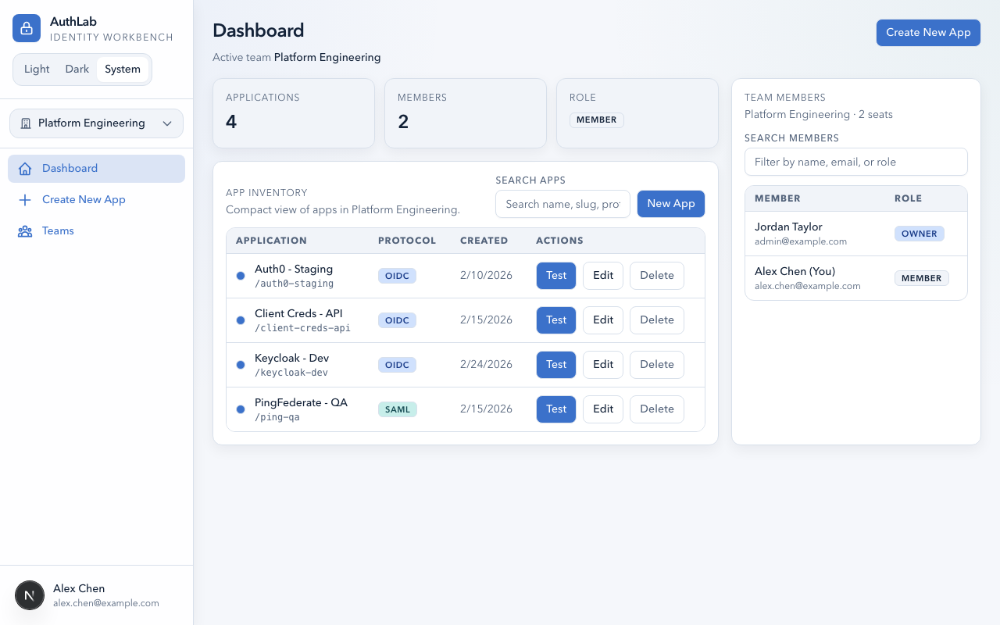
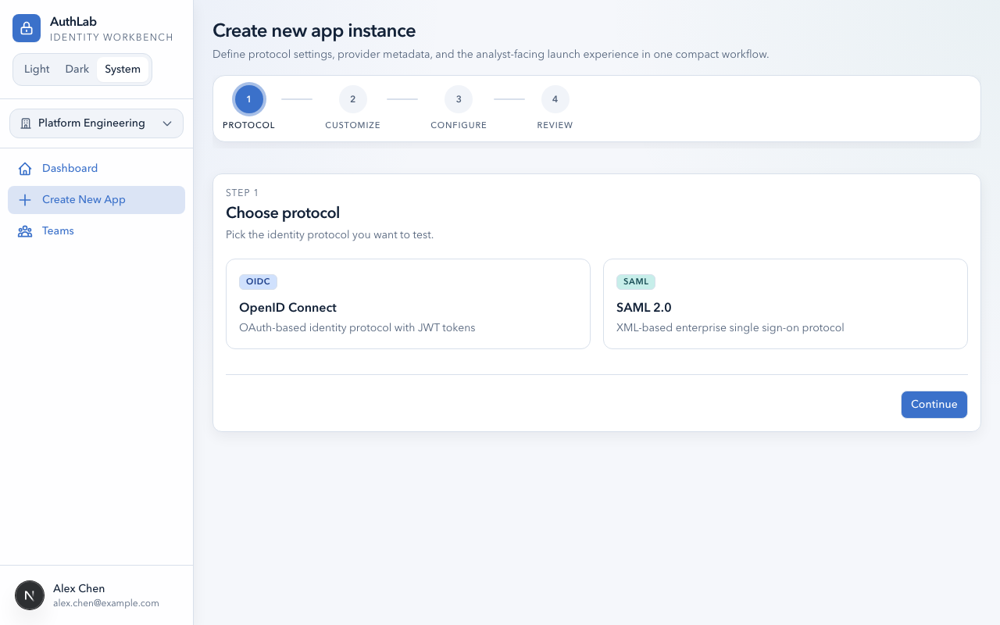
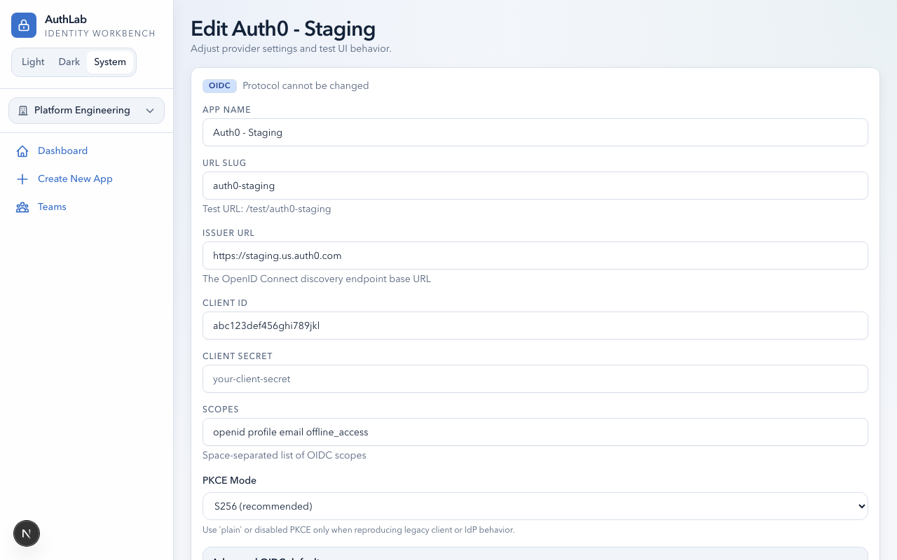
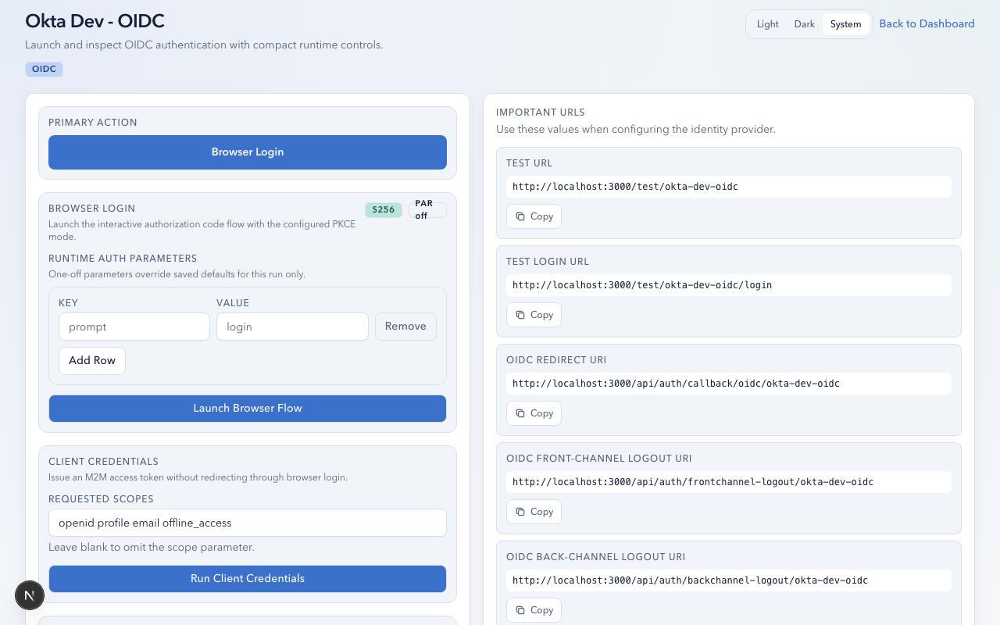
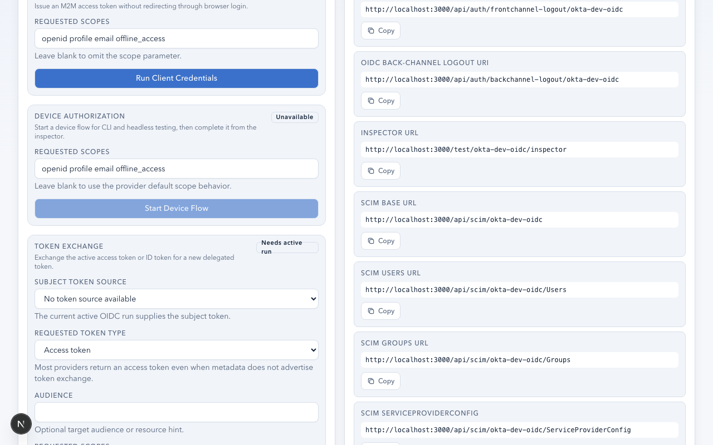

# OIDC User Guide

This guide walks you through setting up, testing, and inspecting OIDC (OpenID Connect) authentication flows in AuthLab.

## Prerequisites

- An AuthLab account with access to at least one team
- An OIDC-capable identity provider (Okta, Entra ID, Auth0, PingFederate, Keycloak, etc.)
- Your provider's **Issuer URL**, **Client ID**, and **Client Secret**

## Creating an OIDC App

1. From your team dashboard, click **Create New App**.

   

2. Select **OIDC** as the protocol and click **Continue**.
3. Fill in the required fields:

| Field | Description | Example |
|-------|-------------|---------|
| **Name** | Display name for the app | `Finance Portal - Okta` |
| **Slug** | URL-safe identifier (auto-generated) | `finance-portal-okta` |
| **Issuer URL** | Your provider's issuer/discovery URL | `https://dev-12345.okta.com` |
| **Client ID** | OAuth client identifier | `0oa1b2c3d4e5f6g7h8i9` |
| **Client Secret** | OAuth client secret | (stored encrypted at rest) |

4. Click **Create**.

After creation, the app settings page shows all OIDC configuration fields:

## Registering Callback URLs

Register these URLs in your identity provider's application settings:

- **Redirect URI**: `{APP_URL}/api/auth/callback/oidc/{slug}`
- **Front-channel logout URI**: `{APP_URL}/api/auth/frontchannel-logout/{slug}`
- **Back-channel logout URI**: `{APP_URL}/api/auth/backchannel-logout/{slug}`
- **Post-logout redirect URI**: `{APP_URL}/test/{slug}`

Replace `{APP_URL}` with your AuthLab instance URL (e.g., `http://localhost:3000` for local development).

These URLs are displayed on the app's test page for easy copying (see right-hand panel below).

## Testing Flows

AuthLab supports four OIDC grant types, each accessible from the **Runtime Launch** panel on the app's test page.

### Browser Login (Authorization Code)

This is the standard browser-based SSO flow.

1. Navigate to your app's test page.
2. Optionally adjust launch settings:
   - **Scopes**: Defaults to `openid profile email`. Add `offline_access` to request refresh tokens.
   - **PKCE Mode**: `S256` (recommended), `PLAIN`, or `NONE`.
   - **PAR**: Enable Pushed Authorization Requests for FAPI-compliant providers.
   - **Custom Parameters**: Add any key-value pairs (e.g., `login_hint`, `prompt`, `acr_values`, `organization`).
3. Click **Login with OIDC**.
4. Authenticate at your identity provider.
5. You are redirected to the **Inspector** with your session results.

### Client Credentials (Machine-to-Machine)

For service-to-service token issuance without user interaction.

1. From the Runtime Launch panel, locate the **Client Credentials** section.
2. Optionally enter custom scopes.
3. Click **Get Token**.
4. The Inspector opens with the resulting access token and claims.

### Device Authorization

For devices or CLI tools that lack a browser.

1. From the Runtime Launch panel, click **Start Device Flow**.
2. AuthLab displays a **user code** and **verification URL**.
3. Open the verification URL on any browser-equipped device and enter the user code.
4. Authorize the session at your identity provider.
5. AuthLab automatically polls until authorization completes.
6. The Inspector opens with the resulting tokens.

### Token Exchange (RFC 8693)

For delegation and impersonation workflows.

1. Complete a browser login first to establish a source session.
2. From the Inspector's lifecycle panel, locate the **Token Exchange** section.
3. Configure the exchange:
   - **Subject Token Source**: `access_token` or `id_token`
   - **Requested Token Type**: `access_token`, `refresh_token`, or `id_token`
   - **Audience** (optional): Target service identifier
   - **Scope** (optional): Requested scopes for the exchanged token
4. Click **Exchange Token**.
5. A new auth run is created with the exchanged token.

## Token Lifecycle Actions

After a successful login, the Inspector's **Lifecycle** panel provides actions to exercise the full token lifecycle against your provider.

### Refresh Tokens

- Click **Refresh Tokens** to exchange the current refresh token for new tokens.
- The timeline shows whether the provider rotated the refresh token or reissued the same one.
- Requires `offline_access` scope (or provider-specific scope) to have received a refresh token.

### Introspect Tokens

- Click **Introspect Access Token** or **Introspect Refresh Token**.
- Returns the provider's view of the token: `active` status, `scope`, `exp`, `client_id`, and any additional metadata.
- Useful for confirming resource-server behavior and token validity.

### Revoke Tokens

- Click **Revoke Access Token** or **Revoke Refresh Token**.
- Calls the provider's revocation endpoint to invalidate the token.
- Follow up with introspection to confirm the provider honored the revocation.

### UserInfo

- Click **Fetch UserInfo** to call the provider's UserInfo endpoint with the current access token.
- Compare UserInfo claims against ID token claims to identify mismatches or missing attributes.

## OIDC Logout Testing

AuthLab supports three logout mechanisms:

### RP-Initiated Logout

1. From the Inspector, click **RP Logout**.
2. AuthLab redirects to your provider's `end_session_endpoint` with the ID token hint.
3. After the provider completes logout, you are redirected back to the test page.
4. Requires the provider to advertise `end_session_endpoint` in discovery.

### Front-Channel Logout

1. Register `{APP_URL}/api/auth/frontchannel-logout/{slug}` as the front-channel logout URI in your provider.
2. When the provider triggers a front-channel logout (e.g., from another RP), AuthLab receives the callback.
3. Matching sessions are marked as logged out based on the `sid` (session ID) parameter.
4. The Inspector shows the logout event in the timeline and compliance report.

### Back-Channel Logout

1. Register `{APP_URL}/api/auth/backchannel-logout/{slug}` as the back-channel logout URI in your provider.
2. When the provider sends a logout token (server-to-server POST), AuthLab validates the JWT signature against the provider's JWKS and matches sessions by `sid` or `sub`.
3. Matched sessions are marked as logged out.
4. The Inspector shows the logout event and the number of matched runs.

## PKCE Modes

| Mode | Behavior | When to Use |
|------|----------|-------------|
| **S256** | SHA-256 code challenge (default) | Recommended for all new integrations |
| **PLAIN** | Plaintext code challenge | Testing legacy or non-compliant providers |
| **NONE** | No PKCE | Public clients or providers that reject PKCE |

## Custom Authorization Parameters

The custom parameters editor lets you pass any key-value pair to the authorization endpoint. Common uses:

| Parameter | Provider | Purpose |
|-----------|----------|---------|
| `login_hint` | All | Pre-fill the login username |
| `prompt` | All | Force `login`, `consent`, or `none` behavior |
| `acr_values` | All | Request specific authentication assurance levels |
| `max_age` | All | Force re-authentication after N seconds |
| `organization` | Auth0 | Target a specific Auth0 organization |
| `connection` | Auth0 | Target a specific Auth0 connection |
| `ui_locales` | Various | Request locale preference |
| `claims` | Various | Request specific claims (JSON-encoded) |

## Pushed Authorization Requests (PAR)

When PAR is enabled:

1. AuthLab sends the authorization parameters to the provider's `pushed_authorization_request_endpoint` first.
2. The provider returns a `request_uri`.
3. AuthLab redirects the browser to the authorization endpoint with only the `request_uri` and `client_id`.
4. This keeps sensitive parameters off the browser URL bar.

PAR is required for FAPI-compliant and many regulated financial/healthcare deployments.

## Tips for Specific Providers

### Okta

- Use a **Custom Authorization Server** issuer (e.g., `https://dev-12345.okta.com/oauth2/default`) for full token lifecycle support.
- The **Org Authorization Server** (`https://dev-12345.okta.com`) has limited introspection/revocation support.
- Add `groups` to scopes if you need group claims.

### Auth0

- Use custom parameters for `organization` and `connection` to test multi-tenant and connection-specific flows.
- Add `offline_access` to scopes to receive refresh tokens.
- Inspect token claims to verify Rules and Actions behavior.

### Entra ID (Azure AD)

- Issuer URL format: `https://login.microsoftonline.com/{tenant-id}/v2.0`
- Use `acr_values` for step-up/MFA policy testing.
- Entra often requires explicit `offline_access` scope for refresh tokens.
- Check `groups` and `roles` claims for app role assignments.

### Keycloak

- Issuer URL format: `https://{host}/realms/{realm}`
- Full support for all OIDC flows including device authorization and token exchange.
- Back-channel logout is well-supported.

## Troubleshooting

| Symptom | Likely Cause | Resolution |
|---------|-------------|------------|
| "Invalid state" on callback | State expired (>10 min) or browser blocked cookies | Retry the login; ensure third-party cookies are allowed |
| No refresh token received | Missing `offline_access` scope | Add `offline_access` to scopes in the launch panel |
| Introspection returns 401 | Provider requires separate resource server credentials | Check provider introspection endpoint configuration |
| Back-channel logout not firing | Logout URI not registered or provider requires HTTPS | Verify the callback URL in provider settings |
| PKCE error at provider | Provider doesn't support the selected PKCE mode | Try switching PKCE mode to match provider capability |
| PAR endpoint not found | Provider doesn't advertise PAR in discovery | Disable PAR and use standard authorization |
