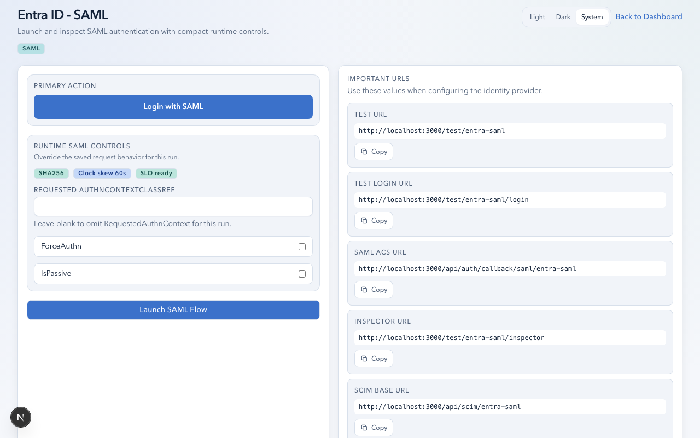
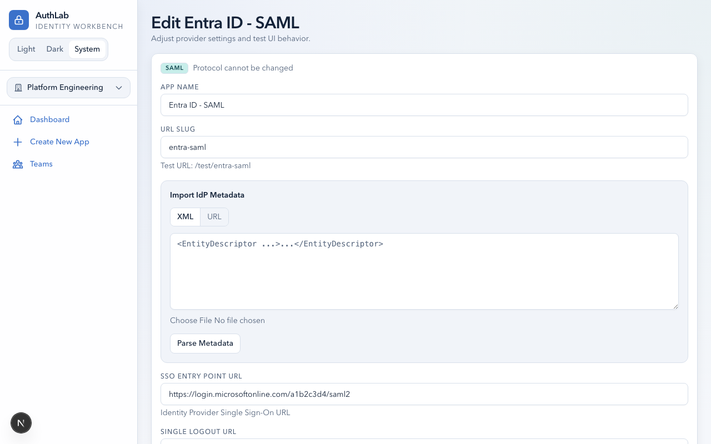
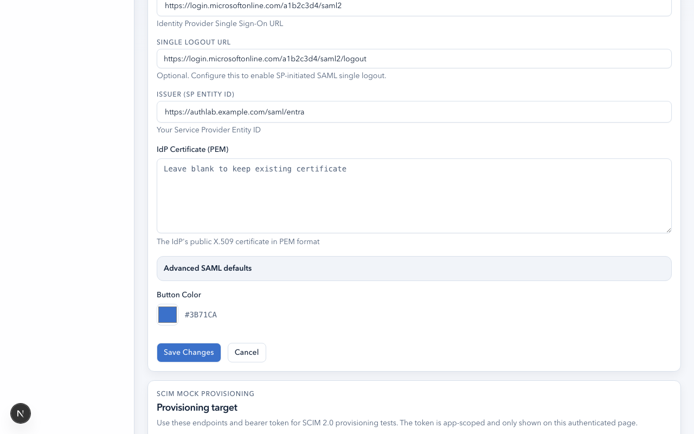
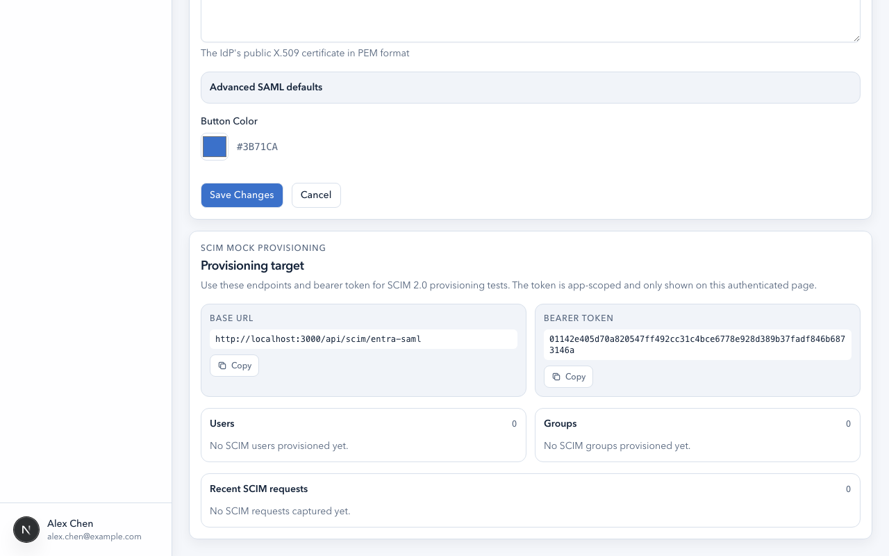

# SAML User Guide

This guide walks you through setting up, testing, and inspecting SAML 2.0 authentication flows in AuthLab.

## Prerequisites

- An AuthLab account with access to at least one team
- A SAML-capable identity provider (Okta, Entra ID, PingFederate, Shibboleth, OneLogin, etc.)
- Your provider's **SSO Entry Point URL**, **Entity ID**, and **IdP Signing Certificate**



## Creating a SAML App

1. From your team dashboard, click **Create New App**.
2. Select **SAML** as the protocol.
3. Fill in the required fields:

| Field | Description | Example |
|-------|-------------|---------|
| **Name** | Display name for the app | `HR Portal - Entra ID` |
| **Slug** | URL-safe identifier (auto-generated) | `hr-portal-entra` |
| **SSO Entry Point** | IdP SSO endpoint URL | `https://login.microsoftonline.com/.../saml2` |
| **Issuer / Entity ID** | SP Entity ID for this app | `https://authlab.example.com/saml/hr-portal` |
| **IdP Certificate** | IdP's X.509 signing certificate (PEM) | Paste full PEM block |

4. Click **Create**.

After creation, the app settings page shows all SAML configuration fields:



### Importing IdP Metadata

Instead of filling fields manually, you can import IdP metadata:

1. In the create/edit form, click **Import IdP Metadata**.
2. Either:
   - Paste the metadata XML directly, or
   - Enter the metadata URL (must be HTTPS)
3. AuthLab parses the metadata and populates the SSO endpoint, Entity ID, and certificate automatically.
4. Review any warnings about binding selection or certificate usage.

Metadata import supports both `EntityDescriptor` and `EntitiesDescriptor` formats. AuthLab prioritizes HTTP-Redirect binding and signing-use certificates.

## Registering Callback URLs

Register these URLs in your identity provider's SAML application settings:

| Purpose | URL |
|---------|-----|
| **ACS (Assertion Consumer Service)** | `{APP_URL}/api/auth/callback/saml/{slug}` |
| **SLO Callback** | `{APP_URL}/api/auth/logout/saml/{slug}/callback` |
| **SP Metadata** | `{APP_URL}/api/saml/metadata/{slug}` |
| **SP Metadata (signed)** | `{APP_URL}/api/saml/metadata/{slug}?signed=true` |

Replace `{APP_URL}` with your AuthLab URL. These URLs are shown on the app's test page.

## SP Signing Material

Many enterprise IdPs require signed SAML requests. AuthLab supports per-app signing material.



### Generating a Test Keypair

1. In the app create/edit form, find the **SP Signing** section.
2. Click **Generate Test Keypair**.
3. AuthLab generates a self-signed RSA-2048 certificate valid for 365 days.
4. The certificate and private key are populated automatically.

### Uploading Your Own Keypair

1. Paste your PEM-encoded private key into the **SP Signing Private Key** field.
2. Paste your PEM-encoded certificate into the **SP Signing Certificate** field.
3. Save the app.

### What Signing Enables

- **Signed AuthN Requests**: When `Sign AuthN Requests` is enabled, outbound SAML requests carry a digital signature.
- **Signed Metadata**: The `?signed=true` metadata endpoint produces digitally signed SP metadata XML.
- **SLO Request Signing**: SP-initiated logout requests are signed when material is present.

## Encrypted Assertion Support

For providers that encrypt SAML assertions (common with Entra ID):

1. In the app create/edit form, find the **SP Encryption** section.
2. Generate or upload an encryption keypair (separate from signing material).
3. AuthLab publishes the encryption certificate in SP metadata so the IdP can encrypt assertions.
4. Incoming encrypted assertions are automatically decrypted using the stored private key.

The encryption certificate uses `keyEncipherment` and `dataEncipherment` key usage, while the signing certificate uses `digitalSignature`.

## SAML Configuration Options



### Authentication Controls

| Setting | Description | Default |
|---------|-------------|---------|
| **NameID Format** | Requested NameID format URI | `unspecified` |
| **ForceAuthn** | Force re-authentication at the IdP | Off |
| **IsPassive** | Attempt silent SSO without user interaction | Off |
| **AuthnContext** | Requested authentication context class | None |

### Security Settings

| Setting | Description | Default |
|---------|-------------|---------|
| **Sign AuthN Requests** | Digitally sign outbound requests | Off (requires signing material) |
| **Signature Algorithm** | `SHA-256` or `SHA-1` | SHA-256 |
| **Clock Skew Tolerance** | Seconds of tolerance for assertion timing | 0 |

### Logout Settings

| Setting | Description |
|---------|-------------|
| **SLO URL** | IdP's Single Logout endpoint URL |

## Testing the SAML Flow

### SP-Initiated Login

1. Navigate to your app's test page.
2. Optionally adjust runtime settings:
   - **Force Authentication**: Override the default ForceAuthn setting
   - **Is Passive**: Override the default IsPassive setting
   - **AuthnContext**: Request a specific authentication context class
3. Click **Login with SAML**.
4. Authenticate at your identity provider.
5. You are redirected to the **Inspector** with assertion details.

### IdP-Initiated Login

1. Start the login from your identity provider's application launcher.
2. The IdP posts the SAML Response directly to AuthLab's ACS endpoint.
3. AuthLab processes the assertion and opens the Inspector.
4. IdP-initiated flows do not use RelayState, so the inspector opens with a new run.

## SAML Single Logout (SLO)

### SP-Initiated Logout

1. From the Inspector, click **SAML SLO**.
2. AuthLab generates a logout request containing the session's NameID and SessionIndex.
3. You are redirected to the IdP's SLO endpoint.
4. The IdP processes the logout and redirects back with a logout response.
5. AuthLab validates the response and clears the local session.

Requirements:
- The app must have a **SLO URL** configured.
- The active session must have a NameID (always present after successful login).
- SP signing material is recommended for signed logout requests.

### IdP-Initiated Logout

1. An administrator triggers logout from the IdP's admin console.
2. The IdP sends a logout request to AuthLab's SLO callback.
3. AuthLab matches the request's NameID and SessionIndex against the active session.
4. If matched, the session is cleared and a success response is returned to the IdP.
5. If not matched, a failure response is returned.

Both HTTP-Redirect and HTTP-POST bindings are supported for SLO.

## SP Metadata Export

AuthLab generates SP metadata that you can provide to your IdP:

### Unsigned Metadata

```
GET {APP_URL}/api/saml/metadata/{slug}
```

Contains:
- SP Entity ID
- ACS endpoint (POST binding)
- SLO callback endpoint (if SLO URL is configured)
- Encryption certificate (if encryption material is configured)
- NameID format (if configured)

### Signed Metadata

```
GET {APP_URL}/api/saml/metadata/{slug}?signed=true
```

Same as unsigned, plus a digital signature using the app's SP signing material. Returns `400` if signing material is not configured.

The metadata is served as `application/samlmetadata+xml` with a download filename.

## Common NameID Formats

| Format | URI | Typical Use |
|--------|-----|-------------|
| **Unspecified** | `urn:oasis:names:tc:SAML:1.1:nameid-format:unspecified` | Default, IdP chooses |
| **Email** | `urn:oasis:names:tc:SAML:1.1:nameid-format:emailAddress` | Email-based identity |
| **Persistent** | `urn:oasis:names:tc:SAML:2.0:nameid-format:persistent` | Opaque, stable identifier |
| **Transient** | `urn:oasis:names:tc:SAML:2.0:nameid-format:transient` | One-time use identifier |

## Common AuthnContext Classes

| Class | URI | Meaning |
|-------|-----|---------|
| **Password** | `urn:oasis:names:tc:SAML:2.0:ac:classes:Password` | Simple password auth |
| **PasswordProtectedTransport** | `urn:oasis:names:tc:SAML:2.0:ac:classes:PasswordProtectedTransport` | Password over TLS |
| **MultiFactor** | `urn:oasis:names:tc:SAML:2.0:ac:classes:MobileOneFactorContract` | MFA required |
| **X509** | `urn:oasis:names:tc:SAML:2.0:ac:classes:X509` | Certificate-based |

## Tips for Specific Providers

### Entra ID (Azure AD)

- Metadata URL: `https://login.microsoftonline.com/{tenant-id}/federationmetadata/2007-06/federationmetadata.xml`
- Entra requires the SP Entity ID to match the Identifier configured in the Enterprise Application.
- Encrypted assertions are common with Entra; upload encryption material and publish it in metadata.
- NameID is often set at the Entra side, not requested by the SP.

### Okta

- Metadata URL: available in the SAML app's Sign On settings.
- Supports ForceAuthn and NameID format requests.
- SLO must be explicitly enabled in the Okta application configuration.
- Attribute mapping is configured in Okta's attribute statements.

### PingFederate

- Supports signed AuthN requests and encrypted assertions.
- Often requires specific signature algorithms (SHA-256 preferred).
- Token exchange and artifact binding are common in Ping environments.
- Clock skew tolerance may be needed for lab/staging environments.

### Shibboleth

- Supports metadata-driven SP registration (provide the signed metadata URL).
- Full SLO support via SOAP and redirect bindings.
- Attribute release policies are configured server-side.
- NameID format should match the attribute resolver configuration.

## Troubleshooting

| Symptom | Likely Cause | Resolution |
|---------|-------------|------------|
| "Invalid signature" on callback | IdP certificate mismatch | Re-import IdP metadata or update the certificate |
| "Audience mismatch" | SP Entity ID doesn't match IdP config | Ensure the Issuer field matches what's registered at the IdP |
| "InResponseTo mismatch" | State cookie expired or cross-site cookie blocked | Enable SameSite=None for production; retry login |
| Encrypted assertion fails | Missing or wrong encryption keypair | Generate/upload encryption material and re-publish metadata |
| SLO returns failure response | NameID or SessionIndex mismatch | Check that the IdP's SLO request contains matching values |
| Signed metadata returns 400 | No signing material configured | Upload or generate SP signing keypair |
| Clock skew errors | Time difference between AuthLab and IdP | Increase clock skew tolerance in app settings |
| IdP-initiated login fails | ACS URL mismatch | Verify the ACS URL registered at the IdP matches exactly |
