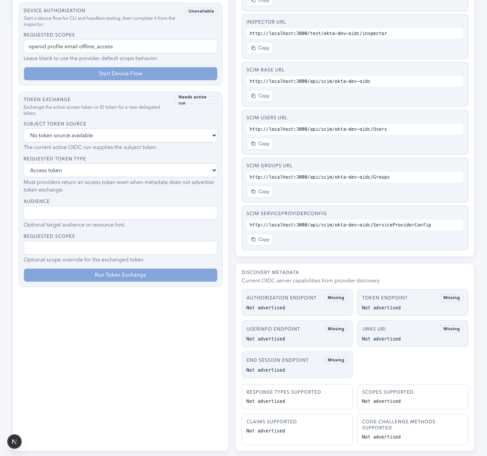

# SCIM Provisioning User Guide

This guide explains how to use AuthLab's mock SCIM 2.0 provisioning endpoints to test identity provider provisioning integrations.

## Overview

AuthLab provides a per-app SCIM mock endpoint that implements the RFC 7643/7644 SCIM 2.0 specification. This allows you to:

- Test your IdP's SCIM provisioning connector against a real endpoint
- Verify user and group create/update/delete operations
- Inspect SCIM request logs for troubleshooting
- Validate filter, pagination, and PATCH operations

Each app instance has its own isolated SCIM endpoint with a unique bearer token.



## Setting Up SCIM

### 1. Find Your SCIM Endpoints

On any app's test page, the **SCIM Provisioning** section displays:

- **SCIM Base URL**: `{APP_URL}/api/scim/{slug}`
- **Bearer Token**: Auto-generated per-app token (click to reveal/copy)

### 2. Configure Your IdP

Register the SCIM connection in your identity provider:

| IdP Setting | Value |
|-------------|-------|
| **Tenant URL / Base URL** | `{APP_URL}/api/scim/{slug}` |
| **Authentication** | Bearer Token |
| **Token** | The bearer token shown on the app's test page |

### 3. Test Connectivity

Most IdPs have a "Test Connection" button. This typically calls the `ServiceProviderConfig` endpoint to verify connectivity and capabilities.

## SCIM Endpoints

All endpoints require the `Authorization: Bearer {token}` header.

### Discovery Endpoints

| Method | Path | Description |
|--------|------|-------------|
| GET | `/api/scim/{slug}/ServiceProviderConfig` | Server capabilities and supported features |
| GET | `/api/scim/{slug}/ResourceTypes` | Supported resource types (User, Group) |
| GET | `/api/scim/{slug}/Schemas` | Full SCIM schema definitions |

### User Endpoints

| Method | Path | Description |
|--------|------|-------------|
| GET | `/api/scim/{slug}/Users` | List users (supports filter and pagination) |
| POST | `/api/scim/{slug}/Users` | Create a user |
| GET | `/api/scim/{slug}/Users/{id}` | Get a single user |
| PUT | `/api/scim/{slug}/Users/{id}` | Replace a user (full update) |
| PATCH | `/api/scim/{slug}/Users/{id}` | Partial update a user |
| DELETE | `/api/scim/{slug}/Users/{id}` | Delete a user |

### Group Endpoints

| Method | Path | Description |
|--------|------|-------------|
| GET | `/api/scim/{slug}/Groups` | List groups (supports filter and pagination) |
| POST | `/api/scim/{slug}/Groups` | Create a group |
| GET | `/api/scim/{slug}/Groups/{id}` | Get a single group |
| PUT | `/api/scim/{slug}/Groups/{id}` | Replace a group (full update) |
| PATCH | `/api/scim/{slug}/Groups/{id}` | Partial update a group |
| DELETE | `/api/scim/{slug}/Groups/{id}` | Delete a group |

## Supported Features

AuthLab's SCIM mock endpoint advertises these capabilities:

| Feature | Supported | Details |
|---------|-----------|---------|
| **PATCH** | Yes | Add, replace, remove operations |
| **Filtering** | Yes | `userName`, `displayName`, `externalId` attributes |
| **Pagination** | Yes | `startIndex` and `count` parameters, max 100 per page |
| **Sorting** | No | Not currently supported |
| **Bulk** | No | Not currently supported |
| **Change Password** | No | Not applicable for mock provisioning |
| **Authentication** | Bearer Token | HMAC-SHA256 derived per app |

## Request Examples

### Create a User

```http
POST /api/scim/{slug}/Users
Authorization: Bearer {token}
Content-Type: application/scim+json

{
  "schemas": ["urn:ietf:params:scim:schemas:core:2.0:User"],
  "userName": "jdoe@example.com",
  "displayName": "Jane Doe",
  "externalId": "ext-12345",
  "name": {
    "givenName": "Jane",
    "familyName": "Doe"
  },
  "emails": [
    {
      "value": "jdoe@example.com",
      "type": "work",
      "primary": true
    }
  ],
  "active": true
}
```

**Response** (201 Created):

```json
{
  "schemas": ["urn:ietf:params:scim:schemas:core:2.0:User"],
  "id": "generated-uuid",
  "userName": "jdoe@example.com",
  "displayName": "Jane Doe",
  "meta": {
    "resourceType": "User",
    "location": "{APP_URL}/api/scim/{slug}/Users/generated-uuid",
    "created": "2026-03-09T...",
    "lastModified": "2026-03-09T..."
  }
}
```

### List Users with Filter

```http
GET /api/scim/{slug}/Users?filter=userName eq "jdoe@example.com"&startIndex=1&count=10
Authorization: Bearer {token}
```

**Response** (200 OK):

```json
{
  "schemas": ["urn:ietf:params:scim:api:messages:2.0:ListResponse"],
  "totalResults": 1,
  "startIndex": 1,
  "itemsPerPage": 10,
  "Resources": [...]
}
```

### PATCH a User

```http
PATCH /api/scim/{slug}/Users/{id}
Authorization: Bearer {token}
Content-Type: application/scim+json

{
  "schemas": ["urn:ietf:params:scim:api:messages:2.0:PatchOp"],
  "Operations": [
    {
      "op": "replace",
      "path": "displayName",
      "value": "Jane Smith"
    },
    {
      "op": "add",
      "path": "phoneNumbers",
      "value": [{"value": "+1-555-0100", "type": "work"}]
    }
  ]
}
```

### Create a Group

```http
POST /api/scim/{slug}/Groups
Authorization: Bearer {token}
Content-Type: application/scim+json

{
  "schemas": ["urn:ietf:params:scim:schemas:core:2.0:Group"],
  "displayName": "Engineering",
  "members": [
    {"value": "user-uuid-1"},
    {"value": "user-uuid-2"}
  ]
}
```

## Filter Syntax

AuthLab supports simple equality filters on these attributes:

| Attribute | Example |
|-----------|---------|
| `userName` | `filter=userName eq "jdoe@example.com"` |
| `displayName` | `filter=displayName eq "Jane Doe"` |
| `externalId` | `filter=externalId eq "ext-12345"` |

Complex filters (and, or, contains, startsWith) are not currently supported by the mock.

## Viewing SCIM Logs


The app's test page shows recent SCIM request logs:

- **Method**: HTTP method (GET, POST, PUT, PATCH, DELETE)
- **Path**: Request path
- **Status Code**: Response status
- **Timestamp**: When the request was received

Click a log entry to see the full request and response payloads.

The log retains the 20 most recent requests per app. This is useful for debugging IdP provisioning connector behavior, verifying attribute mappings, and confirming PATCH operation structure.

## Tips for Specific Providers

### Okta

- Configure SCIM provisioning in the app's "Provisioning" tab.
- Okta tests connectivity via `ServiceProviderConfig` and `Users?filter=userName eq "..."`.
- Enable "Push Groups" to test group provisioning.
- Okta sends PATCH operations for attribute updates.

### Entra ID (Azure AD)

- Use the Enterprise Application's "Provisioning" blade.
- Entra's SCIM connector requires the base URL to end without a trailing slash.
- Entra uses `externalId` for correlation and sends bulk-like sequential requests.
- Test with "Provision on demand" to verify individual user flows.

### OneLogin

- Configure SCIM in the app's "Provisioning" settings.
- OneLogin maps user attributes via its provisioning rules.
- Group push may use `displayName` matching.

### PingFederate / PingOne

- Uses outbound provisioning connections.
- Token-based authentication with the SCIM bearer token.
- May send custom schema extensions in PATCH operations.

## Error Responses

AuthLab returns standard SCIM error responses:

| Status | Meaning |
|--------|---------|
| 400 | Invalid request (missing required fields, malformed JSON) |
| 401 | Missing or invalid bearer token |
| 404 | Resource not found |
| 409 | Conflict (duplicate resource) |
| 500 | Internal server error |

Error response format:

```json
{
  "schemas": ["urn:ietf:params:scim:api:messages:2.0:Error"],
  "detail": "Description of the error",
  "status": "400"
}
```

## Limitations

- This is a **mock** endpoint for testing IdP provisioning connectors, not a production user store.
- Resources are persisted in the database but are scoped to the app instance.
- Complex SCIM filters (boolean operators, nested paths) are not supported.
- Bulk operations are not supported.
- Schema validation is minimal; the mock accepts and stores arbitrary JSON attributes.
- Sorting is not implemented.
