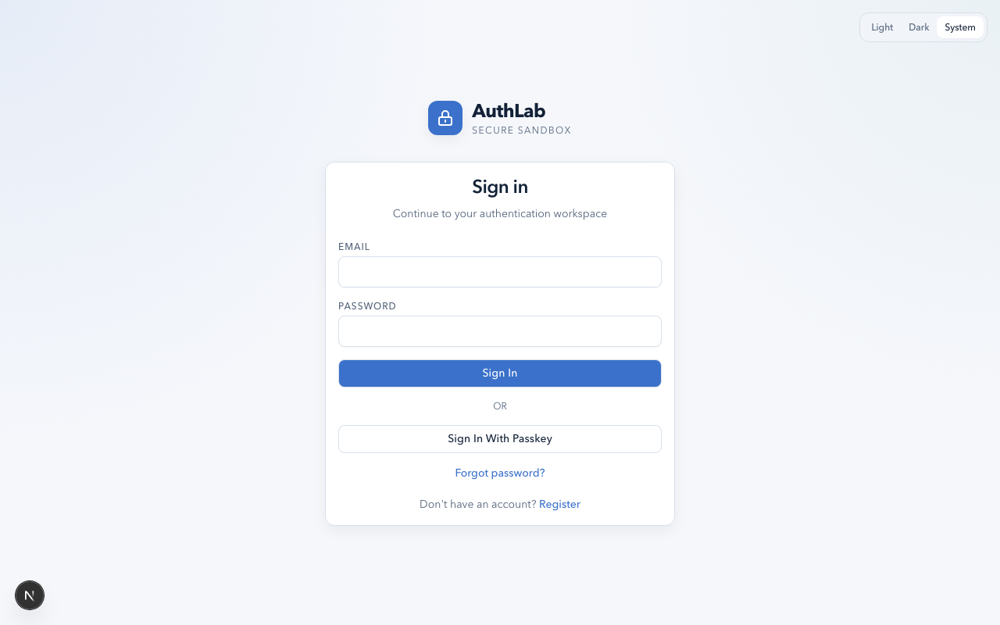
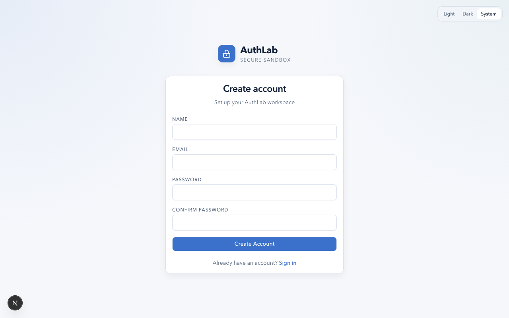
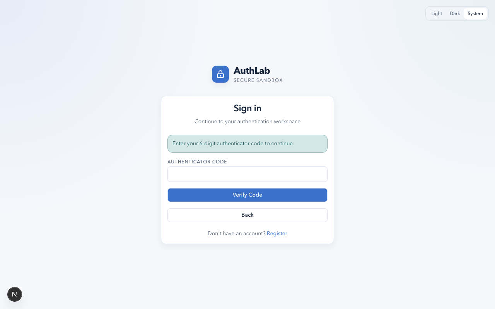
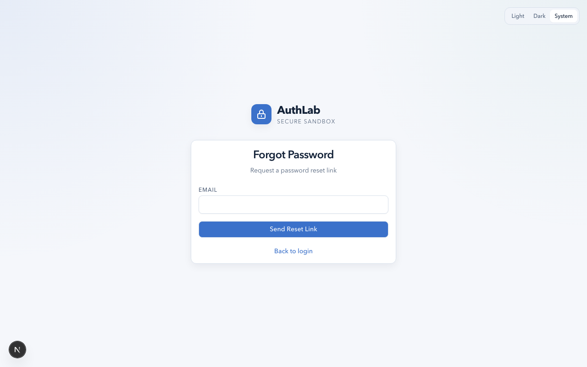
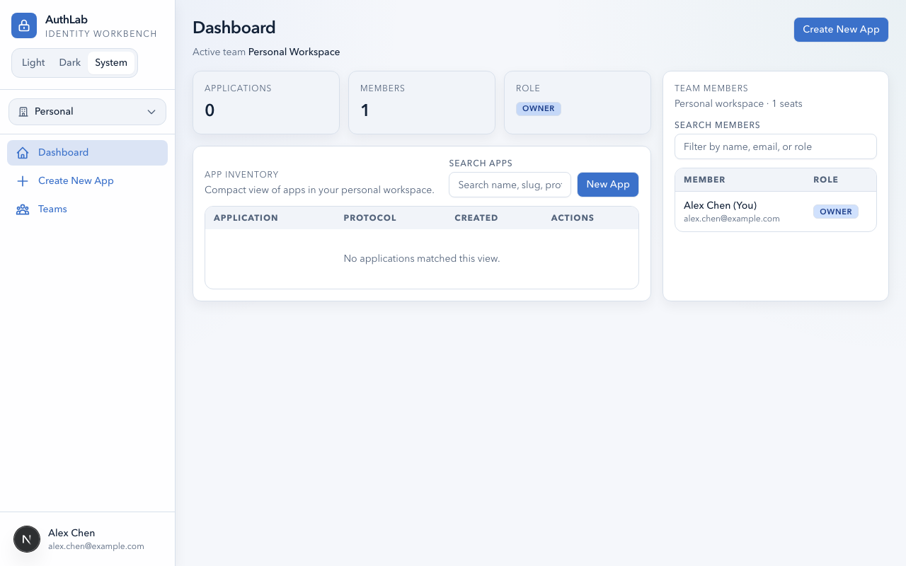
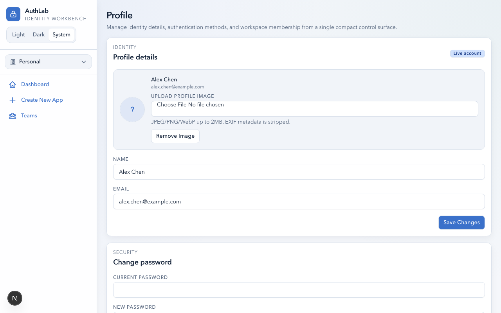
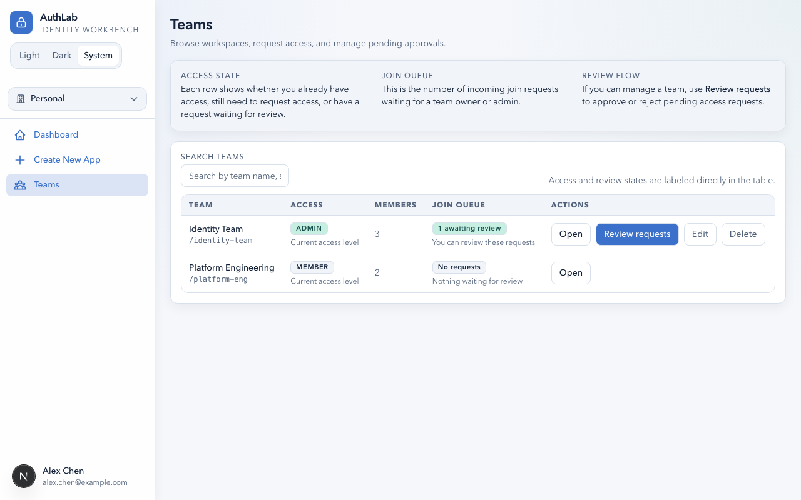
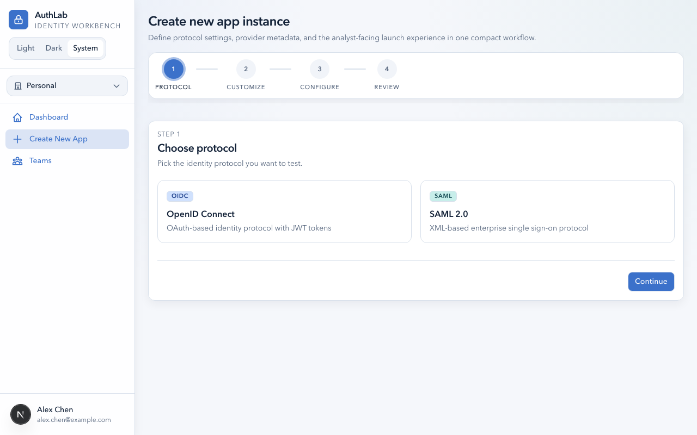

# AuthLab — User Guide

> Your complete guide to using the AuthLab multi-tenant authentication testing workbench.

---

## Table of Contents

- [Getting Started](#getting-started)
  - [Creating Your Account](#creating-your-account)
  - [Logging In](#logging-in)
  - [Navigating the Dashboard](#navigating-the-dashboard)
- [Your Profile and Security](#your-profile-and-security)
  - [Updating Your Profile](#updating-your-profile)
  - [Changing Your Password](#changing-your-password)
  - [Setting Up Two-Factor Authentication (TOTP)](#setting-up-two-factor-authentication-totp)
  - [Managing Passkeys](#managing-passkeys)
- [Teams](#teams)
  - [Browsing Teams](#browsing-teams)
  - [Requesting to Join a Team](#requesting-to-join-a-team)
  - [Accepting a Team Invitation](#accepting-a-team-invitation)
  - [Switching Your Active Team](#switching-your-active-team)
  - [Leaving a Team](#leaving-a-team)
- [Testing Applications](#testing-applications)
  - [Creating an App](#creating-an-app)
  - [Configuring an OIDC App](#configuring-an-oidc-app)
  - [Configuring a SAML App](#configuring-a-saml-app)
  - [Running an Authentication Test](#running-an-authentication-test)
  - [Using the Inspector](#using-the-inspector)
- [OIDC Workflows](#oidc-workflows)
  - [Authorization Code Flow](#authorization-code-flow)
  - [Client Credentials](#client-credentials)
  - [Device Authorization](#device-authorization)
  - [Token Exchange](#token-exchange)
  - [Token Lifecycle Actions](#token-lifecycle-actions)
  - [Logout](#logout)
- [SAML Workflows](#saml-workflows)
  - [SP-Initiated SSO](#sp-initiated-sso)
  - [Signing and Encryption](#signing-and-encryption)
  - [Single Logout](#single-logout)
- [SCIM Provisioning](#scim-provisioning)
  - [Viewing SCIM Endpoints](#viewing-scim-endpoints)
  - [Testing with Your IdP](#testing-with-your-idp)
- [Troubleshooting](#troubleshooting)

---

## Getting Started

### Creating Your Account

1. Open the AuthLab application and click **Register** on the sign-in page.

   

2. Fill in your name, email address, and password.

   

3. Click **Create Account**. If email verification is enabled by your administrator, you will receive a confirmation email. Click the link in the email to verify your account.

> **Note:** The first user to register on a new AuthLab instance is automatically granted System Admin privileges.

### Logging In

1. Enter your email and password on the sign-in page, then click **Sign In**.
2. You can also click **Sign In With Passkey** if you have a passkey registered on your account.
3. If your administrator has enabled two-factor authentication for your account, you will be prompted for your 6-digit authenticator code after entering your credentials.

   

**Forgot your password?** Click the **Forgot password?** link on the sign-in page to request a password reset email.

### Navigating the Dashboard

After signing in, you land on the **Dashboard**. This is your home base for managing authentication test apps.

The dashboard shows:

- **Summary cards** at the top — your current team's application count, member count, and your role
- **App Inventory** — a searchable table of all test applications in your active team
- **Team Members** panel — a quick view of who belongs to your current team

Use the **sidebar** on the left to navigate:

| Menu Item | Description |
|-----------|-------------|
| **Dashboard** | Return to the main app inventory |
| **Create New App** | Start setting up a new OIDC or SAML test app |
| **Teams** | Browse the team directory, manage memberships |
| **User Management** | *(Admin only)* Manage platform users |
| **Admin** | *(Admin only)* Configure email delivery and system settings |

The **team switcher** dropdown at the top of the sidebar lets you switch between teams.

---

## Your Profile and Security

Access your profile settings by clicking your name at the bottom-left of the sidebar, or by navigating to the **Settings** page.

### Updating Your Profile

1. In the **Profile** section, update your **Name** or **Email** address.
2. Upload a profile image by clicking the avatar area and selecting an image file (PNG, JPEG, GIF, or WebP; max 2 MB).
3. Click **Save Changes**.

> **Note:** If you change your email, you may need to verify the new address before the change takes effect.

### Changing Your Password

1. Scroll to the **Change Password** section on the Settings page.
2. Enter your **Current Password**.
3. Enter and confirm your **New Password**.
4. Click **Update Password**.

> **Tip:** Passwords must meet the platform's complexity requirements. Use a mix of uppercase, lowercase, numbers, and symbols.

### Setting Up Two-Factor Authentication (TOTP)

1. In the **Two-Factor Authentication** section, click **Set Up TOTP**.
2. Scan the QR code with your authenticator app (Google Authenticator, Authy, 1Password, etc.).
3. Enter the 6-digit code displayed by your authenticator app.
4. Click **Verify** to enable TOTP on your account.

Once enabled, you will need to enter a code from your authenticator app each time you sign in.

> **Warning:** Store your authenticator app backup codes in a safe place. If you lose access to your authenticator, contact your administrator to disable MFA on your account.

### Managing Passkeys

1. In the **Passkeys** section, click **Register New Passkey**.
2. Follow your browser or device prompt to create a passkey (biometric, security key, etc.).
3. Your registered passkeys are listed with their creation date and last-used timestamp.
4. To remove a passkey, click **Delete** next to it.

---

## Teams

AuthLab is organized around teams. Each team has its own set of test applications and members.

### Browsing Teams

Click **Teams** in the sidebar to see the team directory.

The directory shows all teams on the platform. For each team you can see:

- Team name and member count
- Your membership status (Member, Admin, Owner, or not a member)
- Available actions (Join, Leave, View)

### Requesting to Join a Team

1. Find the team in the directory.
2. Click **Request Access**.
3. Optionally add a note explaining why you need access.
4. A team Owner or Admin will review your request and approve or reject it.

You will see a **Pending** status while your request is being reviewed.

### Accepting a Team Invitation

If a team owner invites you, you will receive an email with an invitation link. Click the link to accept the invitation and join the team.

### Switching Your Active Team

Use the **team switcher** dropdown at the top of the sidebar to switch between teams you belong to. The dashboard and app inventory will update to show the selected team's applications.

### Leaving a Team

1. Navigate to **Settings** and scroll to the **Team Memberships** section, or find the team in the directory.
2. Click **Leave Team**.
3. Confirm the action.

> **Warning:** Leaving a team removes your access to all of that team's applications. If you are the last Owner, you cannot leave until you transfer ownership.

---

## Testing Applications

### Creating an App

1. Click **Create New App** in the sidebar, or click the **New App** button on the dashboard.

   

2. Enter a **Name** for your test application.
3. Select the **Protocol**: OIDC or SAML.
4. Fill in the required provider configuration fields (see protocol-specific sections below).
5. Click **Create Application**.

Your new app appears in the dashboard's app inventory.

### Configuring an OIDC App

After creating an OIDC app, navigate to its settings to configure:

- **Issuer URL** — Your identity provider's issuer endpoint (e.g., `https://accounts.google.com`)
- **Client ID** and **Client Secret** — From your IdP's app registration
- **Scopes** — Space-separated list (default: `openid profile email`)
- **PKCE Mode** — S256 (recommended), Plain, or None
- **PAR** — Enable Pushed Authorization Requests if your IdP supports it
- **Custom Auth Params** — Additional parameters as JSON (e.g., `{"prompt": "consent"}`)
- **Button Color** — Customize the test launch button appearance

> **Tip:** AuthLab auto-discovers endpoints from your issuer URL using OpenID Connect Discovery. You typically only need the issuer URL, client ID, and client secret.

### Configuring a SAML App

After creating a SAML app, configure:

- **Entry Point** — The IdP's Single Sign-On URL
- **Issuer** — Your Service Provider Entity ID
- **IdP Certificate** — The identity provider's signing certificate (PEM format)
- **Name ID Format** — e.g., `urn:oasis:names:tc:SAML:1.1:nameid-format:emailAddress`
- **Signature Algorithm** — SHA-256 (default) or SHA-1
- **SP Signing** — Generate or import a signing keypair for AuthN request signing
- **SP Encryption** — Generate or import an encryption keypair for encrypted assertions
- **AuthnContext** — Request specific authentication context classes
- **Logout URL** — The IdP's Single Logout endpoint

> **Tip:** Use the **Import Metadata** feature to auto-fill settings from an IdP metadata XML URL.

### Running an Authentication Test

1. Navigate to your app's **Test Page** from the dashboard (click the app name or the test link).
2. The test page shows:
   - A **Launch** button to start an authentication flow
   - Grant type selection (Authorization Code, Client Credentials, Device Auth, Token Exchange)
   - **SCIM Endpoints** section with base URL and bearer token
   - **Auth History** — a table of all previous authentication runs
3. Click **Launch** to begin. You will be redirected to your identity provider's login page.
4. After authenticating, you are returned to AuthLab's inspector view.

### Using the Inspector

> **Detailed reference:** See the [Inspector Guide](./guides/inspector-guide.md) for a tab-by-tab walkthrough, SAML-specific diagnostic panels, and step-by-step workflow examples for debugging claims, validating tokens, checking certificate health, and testing logout propagation.

The inspector is a multi-tab diagnostic view that appears after a successful authentication:

| Tab | Shows |
|-----|-------|
| **Lifecycle** | Step-by-step timeline of the auth flow with expandable request/response traces |
| **Token Validation** | JWT signature verification, `at_hash`/`c_hash` checks, `acr`/`amr` values |
| **UserInfo** | On-demand UserInfo endpoint response |
| **Claims Diff** | Side-by-side comparison of ID token vs. UserInfo claims |
| **Timeline** | Visual timeline of token and event timestamps |
| **Compliance** | Protocol-specific spec compliance summary |
| **Trace** | Full HTTP request/response traces for every protocol interaction |
| **SAML Signature** | *(SAML only)* XML signature structure details |
| **SAML Certificate** | *(SAML only)* Certificate health, expiry, and fingerprints |
| **Raw Payload** | Full ID token, SAML assertion XML, or raw token response |
| **JWT Decoder** | Interactive JWT header/payload viewer |

---

## OIDC Workflows

> **Detailed reference:** See the [OIDC Testing Guide](./guides/oidc-user-guide.md) for callback URL registration, PKCE modes, PAR, custom auth parameters, and provider-specific tips for Okta, Auth0, Entra ID, and Keycloak.

### Authorization Code Flow

This is the standard browser-based login flow:

1. Click **Launch** on the test page.
2. AuthLab redirects you to the IdP with an authorization request (including PKCE challenge if configured).
3. Authenticate at the IdP.
4. The IdP redirects back to AuthLab's callback URL with an authorization code.
5. AuthLab exchanges the code for tokens and shows the inspector.

### Client Credentials

For machine-to-machine authentication without user interaction:

1. Select **Client Credentials** as the grant type.
2. Click **Launch**.
3. AuthLab sends a direct token request using the client ID and secret.
4. The inspector shows the access token response.

### Device Authorization

For devices with limited input capabilities:

1. Select **Device Authorization** as the grant type.
2. Click **Launch**.
3. AuthLab displays a **user code** and a **verification URL**.
4. Open the verification URL in another browser, enter the user code, and authenticate.
5. AuthLab polls the token endpoint and displays results when complete.

### Token Exchange

For exchanging one token type for another (RFC 8693):

1. You need an existing authenticated session first.
2. Select **Token Exchange** and configure the subject token and target.
3. Click **Launch** to perform the exchange.

### Token Lifecycle Actions

After a successful authentication, the test page offers lifecycle actions:

- **Refresh Token** — Exchange a refresh token for new access/ID tokens
- **Introspect Token** — Query the IdP's introspection endpoint to check token validity
- **Revoke Token** — Invalidate the access or refresh token at the IdP

Each action creates a new event in the auth run's lifecycle history.

### Logout

AuthLab supports three OIDC logout mechanisms:

1. **RP-Initiated Logout** — Click **Logout** on the test page. AuthLab redirects to the IdP's end_session_endpoint.
2. **Front-Channel Logout** — The test page displays your app's front-channel logout callback URL. Register it with your IdP to receive logout notifications via hidden iframe.
3. **Back-Channel Logout** — The test page displays your app's back-channel logout endpoint URL. Register it with your IdP for server-to-server logout token delivery.

---

## SAML Workflows

> **Detailed reference:** See the [SAML Testing Guide](./guides/saml-user-guide.md) for metadata import, SP signing/encryption keypair setup, SP metadata export, NameID formats, AuthnContext classes, and provider-specific tips for Entra ID, Okta, PingFederate, and Shibboleth.

### SP-Initiated SSO

1. Click **Launch** on the test page for a SAML app.
2. AuthLab generates a SAML AuthN request and redirects to the IdP's entry point.
3. Authenticate at the IdP.
4. The IdP POSTs a SAML response back to AuthLab's ACS callback.
5. The inspector shows assertion details, attributes, and diagnostic tabs.

### Signing and Encryption

- **SP Signing**: Generate a test signing keypair from the app settings. AuthLab will sign AuthN requests and the SP metadata will include the signing certificate.
- **SP Encryption**: Generate an encryption keypair to receive encrypted SAML assertions. The IdP reads the encryption certificate from the SP metadata.

> **Tip:** Click **Generate Test Keypair** in the app settings to create self-signed certificates for testing. For production IdP testing, import your own certificates.

### Single Logout

1. After a successful SAML authentication, click **Logout** on the test page.
2. AuthLab sends a SAML LogoutRequest to the IdP's SLO endpoint.
3. The IdP processes the logout and may respond with a LogoutResponse.

AuthLab also handles IdP-initiated logout callbacks for both redirect and POST bindings.

---

## SCIM Provisioning

> **Detailed reference:** See the [SCIM Testing Guide](./guides/scim-user-guide.md) for full endpoint documentation, request examples, filter syntax, error responses, and provider-specific tips for Okta, Entra ID, OneLogin, and PingFederate.

Each test app includes a built-in SCIM 2.0 mock endpoint for testing user/group provisioning.

### Viewing SCIM Endpoints

On the app's test page, the **SCIM Endpoints** section shows:

- **Base URL** — The SCIM service endpoint for this app (e.g., `https://your-authlab.com/api/scim/{slug}`)
- **Bearer Token** — The authentication token to include in SCIM API requests
- **Resources** — A table of provisioned SCIM users and groups
- **Request Log** — An audit trail of all SCIM API calls

### Testing with Your IdP

1. In your IdP's SCIM provisioning settings, enter the **Base URL** and **Bearer Token** from AuthLab.
2. Trigger a provisioning sync from your IdP.
3. Return to AuthLab to see provisioned users and groups appear in the Resources table.
4. Check the Request Log for detailed request/response information.

The mock endpoint supports the full SCIM 2.0 spec:

| Endpoint | Methods | Purpose |
|----------|---------|---------|
| `/ServiceProviderConfig` | GET | Capabilities discovery |
| `/ResourceTypes` | GET | Supported resource types |
| `/Schemas` | GET | SCIM schema definitions |
| `/Users` | GET, POST | List and create users |
| `/Users/{id}` | GET, PUT, PATCH, DELETE | Manage individual users |
| `/Groups` | GET, POST | List and create groups |
| `/Groups/{id}` | GET, PUT, PATCH, DELETE | Manage individual groups |

---

## Troubleshooting

### Login Issues

- **"Invalid credentials"** — Double-check your email and password. Passwords are case-sensitive.
- **Account not verified** — Check your email for a verification link. If you did not receive it, contact your administrator.
- **MFA code rejected** — Ensure your authenticator app's clock is synchronized. Codes are time-based and expire every 30 seconds.
- **Must change password** — Your administrator has flagged your account for a password reset. Follow the on-screen prompt to set a new password.

### Authentication Flow Errors

- **"Discovery failed"** (OIDC) — Verify that the Issuer URL is correct and the IdP's `.well-known/openid-configuration` endpoint is reachable.
- **"Invalid redirect_uri"** — Register AuthLab's callback URL in your IdP's app configuration. The callback URL is shown on the app's test page.
- **"Invalid signature"** (SAML) — Ensure the IdP certificate in AuthLab matches the certificate the IdP is using to sign assertions.
- **Token exchange or introspection fails** — Confirm that your IdP supports the requested grant type and that the client has the necessary permissions.

### Team Access

- **Can't see apps** — Make sure you have switched to the correct active team using the team switcher.
- **"Access denied"** — Your team role may not have the required permissions. Contact a team Owner or Admin.
- **Join request pending** — A team Owner or Admin needs to approve your request. You will be notified when it is processed.

### Getting Help

If you encounter an issue not covered here, contact your AuthLab administrator for assistance.
